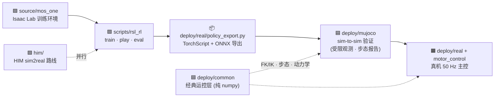

<div align="center">

# 🤖 Mos-One SimReady

### 闭链 USD · Isaac Lab / Isaac Sim 导出工程

[](https://developer.nvidia.com/isaac-sim)
[](https://isaac-sim.github.io/IsaacLab/)
[](https://python.org)
[](https://pytorch.org)
[](./NOTICE.closed-chain-source.md)

<br/>


[快速开始](#-一分钟上手) ·
[训练参数](#-训练脚本参数) ·
[播放结果](#-播放训练结果) ·
[评估结果](#-评估训练结果) ·
[步态评价](doc/步态评价指标.md) ·
[真机部署](deploy/real/README.md) ·
[自定义奖励](#-自定义-reward)

</div>

---

## 📑 目录

| | 章节 | 内容 |
|:--:|:---|:---|
| 🗺️ | [仓库代码结构](#️-仓库代码结构) | [目录总览](#-目录总览) · [各部分功能与后续方向](#-各部分功能与后续方向) |
| ⚡ | [一分钟上手](#-一分钟上手) | 装包 → 冒烟 → 训练 |
| 🎯 | [训练脚本参数](#-训练脚本参数) | [`--terrain` 选项](#️---terrain-选项) · [完整示例](#-完整示例) |
| 📈 | [SwanLab 实验跟踪](#-swanlab-实验跟踪) | 云端/本地看板、离线转换 |
| 🗂️ | [版本记录 & 实验台账](#️-版本记录--实验台账) | todo / CHANGELOG / EXPERIMENTS 三层 |
| 🔍 | [可视化调试关节驱动](#-可视化调试关节驱动) | 正弦步态肉眼检查 |
| 🛠️ | [推荐环境 & 安装](#️-推荐环境--安装) | 已验证版本组合 · 一键安装 |
| 🎬 | [播放训练结果](#-播放训练结果) | `play_latest.sh` · 手动选 checkpoint |
| 📊 | [评估训练结果](#-评估训练结果) | [参数](#️-evalpy-参数) · [指标说明](#-指标说明) · [验证套件](#-一键验证套件) · [`doc/步态评价指标.md`](doc/步态评价指标.md) |
| 🦿 | [控制栈](#-控制栈运动学--步态--动力学--sim2real) | FK/IK · 步态 · 动力学选型 · Sim2Real |
| 📦 | [闭链 USD 注意事项](#-闭链-usd-注意事项) | 别走 URDF Converter · 移动目录后重装 |
| 🏆 | [自定义 Reward](#-自定义-reward) | 实现 + 权重两步 |
| 📌 | [来源](#-来源) | 资产与导出管线信息 |

---

## 🗺️ 仓库代码结构



> 整条工作流：**`source/`（Isaac Lab 训练环境）→ `scripts/`（训练/播放/评估入口）→
> `deploy/real/policy_export.py`（导出 TorchScript/ONNX）→ `deploy/mujoco/`（sim-to-sim 验证)
> → `deploy/real/` + `motor_control/`（真机）**。`him/` 是与 stock PPO 并行的 sim2real 路线；
> `deploy/common/` 是与 Isaac 无关的经典运控层，为传统控制 baseline 和状态估计兜底。

> [!IMPORTANT]
> 🛤️ **想让真机真正跑起来?** 主线计划见 [`todo.md`「真机跑起来·关键路径」](todo.md#️-真机跑起来关键路径主线更新于-2026-06-11)：
> 力矩余量 + IMU → 重训可部署策略(盲 actor + 指令 + 域随机化)→ MuJoCo 受限观测闸门 → 渐进上机。

### 📂 目录总览

> **色块图例**(颜色 = 功能域):🟩 仿真训练 · 🟦 运控/Sim-to-Sim · 🟧 真机硬件 · 🟪 工具与文档 · ⬜ 生成物 · 🟥 待清理

<br/>

#### 🟩 仿真训练

```text
source/mos_one/                          # ⭐ Isaac Lab 扩展包:闭链 USD 训练环境(训练核心)
│
├── mos_one/assets/robots/               #    mos2026_2 闭链 USD 资产
│
└── mos_one/tasks/direct/mos2026_2_closed_usd/
    │
    ├── mos2026_2_closed_usd_env.py      #    DirectRLEnv:obs(45) / action(12) / 终止 / 地形
    │
    ├── mos2026_2_closed_usd_env_cfg.py  #    配置:reward_scales、EventCfg 域随机化、地形
    │
    ├── custom_rewards.py                #    自定义奖励项(含 opt-in 力矩惩罚 sum(τ²))
    │
    └── agents/rsl_rl_ppo_cfg.py         #    PPO 超参(rsl_rl)
```

```text
scripts/                                 # 训练 / 播放 / 评估入口
│
├── rsl_rl/                              #    train / play / eval / eval_report / eval_plot
│                                        #    + eval_suite.sh(一键验证套件)/ play_latest.sh
│
├── {list_envs, inspect_usd, zero_agent, random_agent}.py   # 环境注册检查与冒烟
│
└── setup_mos_one_isaac_lab_sim_env.sh   #    一键创建 env_isaaclab 环境
```

```text
him/                                     # HIM(Hybrid Internal Model)sim2real 路线
│
├── him_env{,_cfg}.py · adapter.py · him_cfg.py   # 盲 actor + 6 步历史(270)、特权 critic(51)
│
└── him_rl/                              #    HIMActorCritic / HIMPPO / runner(HIMLoco 移植)
```

<br/>

#### 🟦 运控 / Sim-to-Sim

```text
deploy/common/                           # 纯 numpy 运控层(无需 Isaac,用根目录 .venv)
│
├── kinematics.py                        #    腿部解析 FK / IK / Jacobian(4 腿向量化)
│
├── gait.py                              #    trot 足端轨迹(支撑直线 + 摆动摆线 + IK)
│
├── dynamics.py                          #    静力/蹬地力矩、GO-M8010-6 T-N 曲线、减速比选型
│
└── speed_map.py                         #    机身速度 → 关节/电机角速度解算与可视化
```

```text
deploy/mujoco/                           # MuJoCo sim-to-sim(assets/mos2026_2.xml)
│
├── play_mujoco.py                       #    在 MuJoCo 里回放 RL 策略 / 调试动作
│
└── standup_torque.py                    #    蹲→站逐关节力矩/电机负载分析(图/CSV/视频/SwanLab)
```

<br/>

#### 🟧 真机硬件

```text
deploy/real/                             # 真机部署
│
├── rl_deploy.py                         #    50 Hz 主控:obs 构建、坐标转换、安全急停
│
├── policy_export.py                     #    导出 TorchScript + ONNX(数值一致性门 <1e-4)
│
└── config/                              #    rl_sar 兼容配置(PD 增益/关节映射/torque limits)
```

```text
motor_control/                           # GO-M8010-6 电机底层(4 路 USB-RS485)
│
├── Linux/                               #    宇树 SDK + motor_ctrl(servo 流式位置伺服)
│
└── scripts/                             #    motor_web.py 电机调试网页 / robot_web.py 站立标定
```

```text
third_party/rl_sar/                      # 子模块:真机部署参考实现(C++)
```

<br/>

#### 🟪 工具与文档

```text
tools/                                   # 辅助工具(按用途分子目录)
│
├── exp/                                 #    log_run 实验台账 / swanlab_convert_local 离线转换
│
├── ckpt/                                #    convert_checkpoint_to_rsl_rl 旧格式转换
│
├── asset/                               #    usd_to_mjcf / strip_embedded_ground / fix_fr_close_loop_path
│
└── isaac/                               #    inspect_joint_limits / speed_viz_isaac(需启动 Isaac)
```

```text
doc/                                     # control_stack / dynamics_gear_ratio_analysis /
│                                        # version_tracking / experiments 台账 / 问题记录 / papers
│
todo.md · CHANGELOG.md                   # 前瞻计划 · 工程里程碑(见「版本记录」一节)
```

<br/>

#### ⬜ 生成物 · 🟥 待清理

```text
logs/ · outputs/ · swanlog_local/        # ⬜ 训练日志 · 脚本产物 · SwanLab 本地看板(生成物)

source/stackforce_mos/                   # 🟥 改名残留(只剩 __pycache__,可整目录删除)
```

### 🧩 各部分功能与后续方向

#### 1. 🟩 `source/mos_one/` — Isaac Lab 训练环境（核心）

闭链 USD 的 DirectRLEnv 任务 `MosOne-Mos20262ClosedUsd-ClosedUsd-v0`：45 维观测
（lin_vel/ang_vel/gravity/dof_pos/dof_vel/prev_action）、12 维关节位置目标动作、
奖励/终止/三种地形（flat/rough/curriculum）、`EventCfg` 域随机化骨架（默认关闭）。

<details>
<summary><b>📋 可继续做 / 优化</b></summary>
<br/>

- **指令条件化重训（最高优先级）**：当前指令不进 obs（固定单指令训练），实测策略对
  `--cmd_vx` 完全无响应。把 vx/vy/wz 加进 observation（45→48 维）重训，才能做
  速度-力矩包络扫描、定真机可行速度上限（需同步改 `rl_deploy.py` 与 `policy_export.py`）。
- ☑️ **力矩惩罚 + effort_limit + armature(2026-06-12 已落地,待重训验证)**：
  `reward_scales["torque"]=-2e-4` 开启、`effort_limit_sim` 12→16、`armature=0.01`
  (反射转子惯量,取自 menagerie go2 同款执行器)。重训后用 `eval_plot.py` 验证
  `fl/rl/rr_shank` 的 ≥80% 力矩饱和与 CoT 4.5 是否缓解、蹦跳步态是否消失。
- **步态整形奖励**：奖励表没有 feet air time / 抬脚高度项、`action_rate=-0.005` 过弱，
  实测步态高频低抬腿（见 [`doc/步态评价指标.md`](doc/步态评价指标.md) 整改对照表）。
- **可部署增益重训**：训练 kp=25/kd=0.5 vs 真机部署 ≈320/3.2（2026-07-04 MuJoCo 实测
  增益失配是硬阻塞，详见 `deploy/real/README.md` 修复记录）。
- **域随机化放量训练**：`--domain_rand --obs_noise_std 0.02` 冒烟已过，跑收敛模型
  与无 DR 基线对比抗扰/泛化。
- **地形课程真正启用**：`terrain_curriculum_enabled` 默认关闭，rough/stairs cfg
  写了但未纳入训练流程（Phase 4 实质未做）。
- **训练侧 actuator 延迟/带宽**：评估侧已有 `--action_delay`，训练侧缺对应 EventTerm。
- 顺手项：删除 `source/stackforce_mos/` 改名残留。

</details>

#### 2. 🟩 `scripts/` — 训练 / 播放 / 评估入口

`rsl_rl/train.py`（PPO + SwanLab 镜像 + `--terrain`/`--max_gpu_mem`）、`play.py`
（回放 + 力矩统计 CSV）、`eval.py`/`eval_report.py`/`eval_plot.py`/`eval_suite.sh`
（多环境定量评估：存活/跟踪/能耗/力矩/步态/打滑 + 泛化测试矩阵）；外层是环境冒烟
工具（`list_envs` / `inspect_usd` / `zero_agent` / `random_agent`）与一键装环境脚本。

<details>
<summary><b>📋 可继续做 / 优化</b></summary>
<br/>

- ☑️ **修接触阈值(2026-06-12 已落地)**：`foot_contact_height_threshold` 0.07→0.15
  （此前 shank body 中心始终高于阈值，`foot_slip` 奖励从未生效、步态指标退化）。
  重训后可用 `eval.py --foot_contact_height` 扫描微调。
- **足端 FK 替代 body 高度近似**：闭链 USD 无接触传感器，接触判定可改用
  `deploy/common/kinematics.py` 的足端 FK，把打滑/占空比指标建立在真实足端上。
- play/eval 与导出产物（`policy.pt`/`.onnx`）打通，做训练→部署的回归测试。

</details>

#### 3. 🟩 `him/` — HIM sim2real 路线（与 stock PPO 并行）

HIMLoco 的 Hybrid Internal Model 移植：盲 actor（去掉 lin_vel + 6 步历史 = 270 维）、
特权 critic（51 维含真值 base_lin_vel + 扰动）、HIM 估计器从历史估计机身速度，
复用本工程 DirectRLEnv 不变，仅换 policy/算法/观测排布。

<details>
<summary><b>📋 可继续做 / 优化</b></summary>
<br/>

- **跑出第一个收敛模型**（目前只验证过 2-iter 冒烟，无收敛产物）。
- **受限观测 MuJoCo 验证估速精度**：不喂 `qvel` 真值，检验 HIM 估计器在部署条件下的表现
  （`play_mujoco.py --lin-vel-source zero` 的受限观测通路已就绪）。
- **路线定线**：stock PPO 的 obs 含特权量 `root_lin_vel_b`（真机拿不到），结构上不可
  部署——需决策转 HIM，还是给 stock 加非对称 critic + 速度估计器。

</details>

#### 4. 🟦 `deploy/common/` — 经典运控层（纯 numpy）

FK/IK/Jacobian（往返误差 1e-16）、trot 步态生成器、动力学/减速比选型（结论：6.33 已
接近最优，力矩不足根因在 effort_limit 与驱动器电流上限）、速度→电机转速映射。
传统控制 baseline、足端接触判定、腿式里程计估速都依赖这一层。

<details>
<summary><b>📋 可继续做 / 优化</b></summary>
<br/>

- **MuJoCo FK 对齐**：XML 加 foot site 后，随机关节角下 FK 足端 vs `mj_forward` 的
  `xpos` 对比，标定 `L_shank`（目前按站立几何估计 ≈0.16 m）。
- **闭链传动标定**：「shank 电机轴角 ↔ 等效膝关节角」映射 + 约定角→sim/motor 仿射
  映射，使 IK 解能直接下发到 `rl_deploy.py` / robot_web。
- **gait 实际走起来**：把足端轨迹经映射下发到 MuJoCo/真机（Phase 2 传统控制 baseline）。
- **腿式里程计**：足端 FK + 接触相位估机身线速度，给真机 `lin_vel_source="zero"` 兜底。

</details>

#### 5. 🟦 `deploy/mujoco/` — sim-to-sim 验证

`play_mujoco.py` 在 MuJoCo 里回放 RL 策略（新旧 checkpoint 格式均可，层结构从权重形状
自动推导），并支持**部署条件仿真**：`--lin-vel-source zero` / `--imu-source stub` 复刻
真机受限观测、`--kp/--kv` 模拟部署增益、`--settle` 对齐站姿保持、`--action-lpf` 动作低通、
`--slowmo` 慢放；headless / 关窗时输出**步态量化报告**（占空比/步频/抬脚/对角同步率，
判读标准见 [`doc/步态评价指标.md`](doc/步态评价指标.md)）。`standup_torque.py` 做蹲→站
逐关节力矩/电机负载分析（图、CSV、慢放视频叠力矩条、SwanLab 实时上报）。

> [!WARNING]
> 2026-07-04 实测：训练增益 kp=25 下 MuJoCo 软闭链撑不住自重、四连杆翻折叠分支，
> 无法验证策略；部署增益 kp=320 能站但策略立即失稳（增益失配）。详见
> `deploy/mujoco/README.md` 的测试结论。

<details>
<summary><b>📋 可继续做 / 优化</b></summary>
<br/>

- ☑️ **受限观测通路(2026-07-04 已落地)**：`--lin-vel-source zero` / `--imu-source stub`
  可复刻真机输入；仍缺「估计器」半边——接 HIM / 腿式里程计替代喂 0。
- **闭链刚性建模**：软 `<connect>` 在 kp=25 下会穿奇异翻分支（solref/solimp/限位均无效，
  两分支被动角区间重叠），需模型手术或换 mjlab 刚性闭链后端。
- **复用导出产物**：增加直接加载 `policy_export.py` 产出的 `policy.pt`/`.onnx` 的
  路径，做导出产物的 sim-to-sim 回归。

</details>

#### 6. 🟧 `deploy/real/` — 真机部署

`rl_deploy.py`：50 Hz 确定性主控，ServoProc 封装 4 路串口、`JointMeta` 旋子↔sim 双向
转换、45 维 obs 按训练合约组建、姿态超限急停、电机过温/错误码急停、力矩超限告警、
`--action_lpf` 动作低通、`--no_rl` 调试模式。`policy_export.py`：TorchScript + ONNX
双导出，数值一致性门 <1e-4。`config/mos2026_2.yaml`：rl_sar 兼容。
（☑️ 2026-07-04 修复了「关节侧 rl_kp 被当转子侧 K_P 下发」的 40 倍增益 bug，
现读 `hardware.motor_kp/motor_kw`；详见 `deploy/real/README.md` 修复记录。）

<details>
<summary><b>📋 可继续做 / 优化（按上机顺序）</b></summary>
<br/>

- **`sim_sign` 实机逐关节验证**（yaml 全是默认值 1，上机前必做）。
- **IMU 接入**：当前 `imu_source="stub"`（ang_vel=0、gravity=[0,0,-1]），policy 无
  姿态感知不能真正平衡；需在 `_build_obs` 扩展 serial/udp 分支。
- **线速度估计**：`lin_vel_source="zero"`，根本解法是重训去掉 lin_vel 或接 HIM 估计器。
- **首次上机流程**：吊线 + `--no_rl` 验证 obs（站姿 q_sim≈0）→ 低增益低速 RL 测试。
- **obs 单位对齐文档**：IMU 系→机体系旋转、关节顺序与 `joint_map.default.json` 对账。

</details>

#### 7. 🟧 `motor_control/` — 电机底层与整机标定

宇树 GO-M8010-6 SDK 封装（`motor_ctrl`：驱动/读取/servo 流式位置伺服）+ 两个零依赖
网页工具：`motor_web.py`（ID 管理、单电机驱动、扭矩监控）、`robot_web.py`（趴/站姿
标定、单腿验证、方向验证、限速站立）。真机已能站起来。

<details>
<summary><b>📋 可继续做 / 优化（力矩/电流不足专项）</b></summary>
<br/>

- **驱动链路排查**：驱动器电流上限是否设低、电池/电源大负载下是否掉压限流、
  减速比/Kt 标定核对（选型分析已排除减速比问题）。
- **重力前馈**：站立加 gravity compensation，减少纯 PD 力矩负担；复核站立姿态避免大力臂。
- **量化闭环**：记录站立/支撑相实测力矩电流 vs 理论需求（τ_knee≈2.2 静立 / 4.5 trot），
  上调后重测站立维持 + 侧推抗扰，有余量再推进行走。

</details>

#### 8. 🟪 `tools/` · `doc/` · 版本记录

`tools/`：按用途分四个子目录——`exp/`（实验台账追加 `log_run.py`、SwanLab 离线转换）、
`ckpt/`（旧 checkpoint 格式转换 `convert_checkpoint_to_rsl_rl.py`，已验证转换后指标逐位
一致）、`asset/`（USD→MJCF、嵌入地面剥离等资产处理）、`isaac/`（需启动 Isaac 的检查/
可视化：关节限位 `inspect_joint_limits.py`、速度↔电机角速度 `speed_viz_isaac.py`）。
`doc/`：控制栈说明、动力学/减速比
选型、三层版本记录规范、实验台账（EXPERIMENTS.md）、问题记录、参考论文。

<details>
<summary><b>📋 可继续做 / 优化</b></summary>
<br/>

- 训练跑完坚持用 `tools/exp/log_run.py` 记台账，保持「todo（计划）/ CHANGELOG（里程碑）/
  EXPERIMENTS（因果）」三层闭环不断档。
- `usd_to_mjcf.py` 与 `doc/mjlab_integration.md` 的 mjlab 路线可继续推进，作为
  Isaac 之外的第二训练后端。

</details>

---

## ⚡ 一分钟上手

```bash
# 1️⃣ 激活你已有的 Isaac Lab 环境
conda activate <你自己的IsaacLab环境名称>

# 2️⃣ 安装导出工程（--no-deps 防止顶坏 Isaac 依赖）
cd <exported_project>
uv pip install -e source/mos_one --no-deps

# 2.5️⃣ 拉取子模块（rl_sar，真机部署参考实现；不拉不影响训练/仿真）
git submodule update --init --depth 1

# 3️⃣ 检查环境注册情况
python scripts/list_envs.py
python scripts/inspect_usd.py --headless

# 4️⃣ 用 zero / random agent 跑一遍，确认 USD 加载正常
python scripts/zero_agent.py   --task MosOne-Mos20262ClosedUsd-ClosedUsd-v0 --headless --num_envs 4 --num_steps 200
python scripts/random_agent.py --task MosOne-Mos20262ClosedUsd-ClosedUsd-v0 --headless --num_envs 4 --num_steps 200

# 5️⃣ 开始 PPO 训练（先跑 20 个 iteration 做冒烟验证）
python scripts/rsl_rl/train.py \
    --task MosOne-Mos20262ClosedUsd-ClosedUsd-v0 \
    --headless --max_iterations 3000 \
    --terrain curriculum \
    --max_gpu_mem 10
```

> [!TIP]
> **常用开关**
> - 🖥️ 想打开 Isaac Sim 窗口看效果：去掉 `--headless`
> - 🔁 想一直播放直到手动关窗口：`--num_steps 0`

---

## 🎯 训练脚本参数

> `scripts/rsl_rl/train.py`

| 参数 | 类型 | 默认值 | 说明 |
|:---|:---:|:---:|:---|
| `--task` | `str` | **必填** | Gym 任务 ID，本工程为 `MosOne-Mos20262ClosedUsd-ClosedUsd-v0` |
| `--num_envs` | `int` | `16384` | 并行环境数。默认 16384（=4096×4，按 RTX 5090 32GB 设）；显存吃紧先用 `16` 冒烟，小卡用 `4096` 或更低 |
| `--max_iterations` | `int` | `5000` | PPO 学习迭代次数，冒烟可用 `20` |
| `--seed` | `int` | 任务默认 | 随机种子 |
| `--run_name` | `str` | `""` | 给本次训练加后缀，出现在日志目录名里，方便对比实验 |
| `--checkpoint` | `str` | `None` | 续训用的 `.pt` 路径（由 RSL-RL 内部恢复） |
| `--agent` | `str` | `rsl_rl_cfg_entry_point` | Hydra agent 配置入口，通常不用改 |
| `--terrain` | `str` | `flat` | 地形模式（详见下表） |
| `--max_gpu_mem` | `float` | `32.0` | 显存预算 (GB)。在 16/8 GB 卡上传入对应数值，PhysX 容量按比例缩放 |

### 🗺️ `--terrain` 选项

| 取值 | 地形 | 课程学习 | 用途 |
|:---:|:---|:---:|:---|
| `flat` | 🟩 平地 | ❌ | 默认，新策略起步、调奖励 |
| `rough` | 🏔️ 程序生成高度场 | ❌ | 直接训练崎岖地形，难度恒定 |
| `curriculum` | 📈 平地 → 崎岖 + 楼梯 | ✅ | 所有 env 从第 0 行起步，跑稳后自动升级难度 |

<details>
<summary><strong>🔧 AppLauncher 透传参数</strong></summary>

<br/>

`AppLauncher.add_app_launcher_args(parser)` 会注入 Isaac Sim 的标准参数，常用如下：

| 参数 | 说明 |
|:---|:---|
| `--headless` | 不启用 GUI，训练务必开启 |
| `--device cuda:0` | 指定 GPU，多卡机器需要 |
| `--enable_cameras` | 启用相机渲染（占显存，默认关） |
| `--livestream {0,1,2}` | 推流到 Omniverse Streaming Client / WebRTC，适合服务器训练时远程查看 |

</details>

### 💡 完整示例

```bash
# 1️⃣ 冒烟跑 20 个 iteration，小 env 验证管线
python scripts/rsl_rl/train.py \
    --task MosOne-Mos20262ClosedUsd-ClosedUsd-v0 \
    --headless --num_envs 16 --max_iterations 20

# 2️⃣ 正式训练，带 run_name 方便日志对比
python scripts/rsl_rl/train.py \
    --task MosOne-Mos20262ClosedUsd-ClosedUsd-v0 \
    --headless --num_envs 4096 --max_iterations 1500 \
    --seed 42 --run_name baseline_flat

# 3️⃣ 课程学习地形上训练
python scripts/rsl_rl/train.py \
    --task MosOne-Mos20262ClosedUsd-ClosedUsd-v0 \
    --headless --num_envs 4096 --terrain curriculum \
    --run_name curriculum_v1

# 4️⃣ 在 16GB / 8GB 显卡上训练：同时缩 PhysX 容量和 env 数
python scripts/rsl_rl/train.py \
    --task MosOne-Mos20262ClosedUsd-ClosedUsd-v0 \
    --headless --num_envs 2048 --max_gpu_mem 16 \
    --max_iterations 1500 --run_name gpu16

python scripts/rsl_rl/train.py \
    --task MosOne-Mos20262ClosedUsd-ClosedUsd-v0 \
    --headless --num_envs 1024 --max_gpu_mem 8 \
    --max_iterations 1500 --run_name gpu8
```

> [!NOTE]
> 📂 日志目录：`logs/rsl_rl/<experiment_name>/<时间戳>[_<run_name>]/`  
> 💾 Checkpoint 落在 `model_final.pt` 与 `model_*.pt`

---

## 📈 SwanLab 实验跟踪

训练默认开启 [SwanLab](https://swanlab.cn)，把 rsl_rl 写进 TensorBoard 的所有标量（reward、loss、各项奖励分量等）**自动镜像**一份到 SwanLab，方便跨实验对比。`scripts/rsl_rl/train.py`（PPO）和 `him/train.py`（HIM）都支持，参数一致。

> [!IMPORTANT]
> 镜像通过 patch TensorBoard 的 `SummaryWriter`，所以 SwanLab 在建 runner 之前启动即可，**无需改动任何训练/奖励代码**。未安装 swanlab 时自动跳过，初始化失败也只回退到纯 TensorBoard，不影响训练。

### ⚙️ 相关参数

| 参数 | 默认值 | 说明 |
|:---|:---:|:---|
| `--no_swanlab` | 关闭开关 | 加上即彻底关闭 SwanLab（默认开启） |
| `--swanlab_project` | `mos_one-mos` | 项目名。PPO 与 HIM 用同一项目便于对比 |
| `--swanlab_mode` | `cloud` | 运行模式：`cloud` 上传云端 / `local` 本地看板 / `offline` 离线缓存 / `disabled` 关闭 |

### 🚀 首次使用

```bash
# 1️⃣ 安装（注意 swanlab 会顶坏 Isaac 的 wrapt/sentry-sdk 版本，装完务必降回）
pip install swanlab
pip install "wrapt==1.16.0" "sentry-sdk==1.43.0"

# 2️⃣ cloud 模式首次需登录一次（在 https://swanlab.cn 账户设置里拿 API Key）
swanlab login

# 3️⃣ 正常训练即可，标量会自动上传到云端 project=mos_one-mos
python scripts/rsl_rl/train.py \
    --task MosOne-Mos20262ClosedUsd-ClosedUsd-v0 \
    --headless --num_envs 4096 --run_name baseline_flat
```

### 💡 常见用法

```bash
# 不想联网 / 服务器无外网：本地看板模式
python scripts/rsl_rl/train.py ... --swanlab_mode local

# 完全关闭 SwanLab（只留 TensorBoard）
python scripts/rsl_rl/train.py ... --no_swanlab

# 自定义项目名
python scripts/rsl_rl/train.py ... --swanlab_project my-exp
```

> [!TIP]
> 已经跑完、只有 TensorBoard 日志、想离线转成 SwanLab 本地看板看？用 `tools/exp/swanlab_convert_local.py`（绕开了 SwanLab 0.8.0 本地转换的登录 bug）：
> ```bash
> # 用装了 swanlab 的 Isaac venv 跑转换
> ../env_isaaclab/bin/python3 tools/exp/swanlab_convert_local.py \
>     logs/rsl_rl/<experiment>/<时间戳> \
>     --out ./swanlog_local --project mos_one-mos
> # 再本地起看板
> ../env_isaaclab/bin/swanlab watch ./swanlog_local
> ```

---

## 🗂️ 版本记录 & 实验台账

仓库用**三层文档 + git tag** 记录演进，各回答一个不同问题，互不重复（SwanLab 管指标曲线，台账管叙事决策）：

| 层 | 文件 | 回答 |
|---|---|---|
| 前瞻计划 | [`todo.md`](todo.md) | 接下来做什么 |
| 工程里程碑 | [`CHANGELOG.md`](CHANGELOG.md) + git tag | 代码现在能做什么了 |
| 实验迭代台账 | [`doc/experiments/EXPERIMENTS.md`](doc/experiments/EXPERIMENTS.md) | 我试了什么、为什么、学到什么 |

训练跑完，一行命令把这次迭代记进台账（自动拉 git/run/seed，曲线链接回 SwanLab）：

```bash
python3 tools/exp/log_run.py --run-dir logs/rsl_rl/<exp>/<ts>_<run_name> \
  --title "..." --hypothesis "..." --changes "..." \
  --conclusion "..." --swanlab-url <run链接>   # 先 --dry-run 预览
```

完整说明（三层闭环、tag 规范、补打历史 tag 的命令）见 **[`doc/version_tracking.md`](doc/version_tracking.md)**。

## 🔍 可视化调试关节驱动

闭链 USD 的随机动作默认会保持若干步，避免每帧高频随机在视觉上互相抵消。

需要肉眼检查关节驱动时，可以用**正弦步态**：

```bash
python scripts/random_agent.py \
    --task MosOne-Mos20262ClosedUsd-ClosedUsd-v0 \
    --num_envs 1 --num_steps 0 \
    --motion_mode gait --action_gain 0.1
```

---

## 🛠️ 推荐环境 & 安装

### 已验证版本组合

| 组件 | 版本 |
|:---|:---|
| 🐍 Python | `3.11` |
| 🎮 Isaac Sim | `5.1.0` |
| 🧪 Isaac Lab | `v2.3.2` / pip `2.3.2.post1` |
| 🔥 PyTorch | `2.7.0+cu128` |
| 👁️ Torchvision | `0.22.0+cu128` |
| 🦿 rsl_rl | 由 LeggedGym-Ex `0.3.0` 提供 |

### 🚀 一键安装

```bash
chmod +x scripts/setup_mos_one_isaac_lab_sim_env.sh
./scripts/setup_mos_one_isaac_lab_sim_env.sh
```

脚本默认创建 `env_isaaclab` 环境。要改环境名：

```bash
ENV_NAME=my_isaaclab ./scripts/setup_mos_one_isaac_lab_sim_env.sh
```

<details>
<summary><strong>🖥️ 多 GPU 机器：窗口无法显示？</strong></summary>

<br/>

先确认显示器接在哪张 GPU 上，再用对应 GPU 启动：

```bash
nvidia-smi --query-gpu=index,pci.bus_id,name,display_active --format=csv,noheader

CUDA_VISIBLE_DEVICES=<display_active 为 Enabled 的 GPU index> \
    python scripts/rsl_rl/play.py \
        --task MosOne-Mos20262ClosedUsd-ClosedUsd-v0 \
        --checkpoint <checkpoint.pt> \
        --num_envs 1 --disable_resets
```

</details>

---

## 🎬 播放训练结果

一键脚本会自动找出 `logs/` 下最新的 `.pt` 并启动 play.py：

```bash
# 默认: 20 envs + 关闭 reset
./scripts/rsl_rl/play_latest.sh

# 想改播放参数，直接在后面追加（会原样转发给 play.py）
./scripts/rsl_rl/play_latest.sh --num_envs 1 --num_steps 0 --disable_resets

# 想换任务或日志目录，用环境变量覆盖
TASK=MosOne-Mos20262ClosedUsd-ClosedUsd-v0 LOGS_DIR=logs \
    ./scripts/rsl_rl/play_latest.sh
```

<details>
<summary><strong>🔎 手动选择 Checkpoint</strong></summary>

<br/>

```bash
# 查找最新的 checkpoint
find logs -name "*.pt" | sort | tail -n 1

# 播放指定 checkpoint
python scripts/rsl_rl/play.py \
    --task MosOne-Mos20262ClosedUsd-ClosedUsd-v0 \
    --checkpoint <上一步找到的 .pt 文件> \
    --num_envs 20 --disable_resets
```

</details>

---

## 📊 评估训练结果

> 训练 reward 高 ≠ 真实表现好。播放只是肉眼看，**定量验证**才能发现 reward hacking、步态异常、力矩不足、泛化差等问题。

`scripts/rsl_rl/eval.py` 以**多并行环境、关闭探索噪声**的方式跑策略，直接读取环境内部真实状态（速度、跌倒判定、12 个关节力矩、足端 body、地形原点）统计一整套指标，并写出 JSON；`eval_report.py` 把多个 JSON 汇总成验证表 + CSV。

```bash
# 平地基线：64 个环境跑 3000 步（=60s，约数十个回合）
python scripts/rsl_rl/eval.py \
    --headless --num_envs 64 --num_steps 3000 \
    --load_run 2026-06-07_22-11-43 --tag flat_default

# 结果默认写到 <checkpoint目录>/eval/<tag>.json
```

### ⚙️ `eval.py` 参数

| 参数 | 默认 | 说明 |
|:---|:---:|:---|
| `--load_run` | `.*` | 选择 `logs/rsl_rl/<exp>/` 下的训练 run（正则） |
| `--checkpoint` | `model_.*.pt` | checkpoint 文件名正则，或直接给 `.pt` 绝对路径 |
| `--num_envs` | `64` | 并行评估环境数，越多统计越稳 |
| `--num_steps` | `3000` | 控制步数（dt=0.02s；1000 步 = 一个完整回合） |
| `--tag` | `eval` | 结果标签，决定 JSON 文件名与报告分组 |
| `--terrain` | `flat` | `flat` / `rough` / `curriculum` |
| `--cmd_vx/--cmd_vy/--cmd_wz` | 训练值 | 覆盖速度/偏航指令（指令泛化测试） |
| `--friction` | — | 覆盖地面静/动摩擦（泛化测试） |
| `--mass_scale` | `1.0` | 按比例缩放机器人质量（负载测试，例 `1.1`=+10%） |
| `--obs_noise` | `0.0` | 观测高斯噪声标准差（传感器噪声测试） |
| `--action_delay` | `0` | 动作延迟步数（每步 20ms；sim-to-real 延迟测试） |
| `--push_interval_s` / `--push_vel` | `0` / `0.5` | 每隔 N 秒对 base 施加随机水平速度冲量（推搡测试） |

### 📋 指标说明

| 类别 | 指标 | 含义 |
|:---|:---|:---|
| 🟢 存活 | `success_rate` / `fall_rate` / `mean_survival_s` | 回合走完率 / 跌倒率 / 平均存活时间 |
| 🎯 跟踪 | `vx_rmse` / `vy_mae` / `yaw_mae` | 速度/偏航跟踪误差（指令 vs 实际） |
| 🧍 姿态 | `mean_base_height` / `mean_upright_err` | base 高度（目标 0.32）/ 倾斜误差 |
| 🔋 能耗 | `mean_power_w` / `mean_cot` | 平均机械功率 / 运输成本 CoT = E/(m·g·d) |
| ⚙️ 力矩 | per-joint `abs_mean` / `rms` / `abs_max` / `near_limit_frac` | 每关节力矩统计 + **近上限占比**（上限自动读 `effort_limit_sim`） |
| 🦿 步态 | `duty_factor` / `touchdown_hz` / `diag_inphase_rate` | 占空比 / 触地频率 / 对角同相位率（判断 trot vs bound） |
| 👣 打滑 | `mean_foot_slip` | 接触脚水平速度平方和 |

> [!NOTE]
> 本闭链 USD 没有接触传感器，步态指标用**足端 body 高度**近似接触判定。
> 指令不进 observation（固定单指令训练），所以指令泛化测试是“换指令重建环境跑一遍”。

> [!TIP]
> 各步态指标的**健康区间与判读优先级**（对角同步率 → 步频 → 占空比 → 抬脚高度……）
> 见 **[📄 doc/步态评价指标.md](doc/步态评价指标.md)**；MuJoCo 部署条件下的同款指标由
> `deploy/mujoco/play_mujoco.py` 的 `[gait]` 报告输出，两边对照可区分「策略问题」与「sim2sim 失配」。

### 🧪 一键验证套件

`eval_suite.sh` 按“仿真泛化 → sim-to-real、简单 → 复杂”的顺序跑完整验证表（指令 / 地形 / 摩擦 / 质量 / 推搡 / 噪声 / 延迟），最后自动汇总：

```bash
# 用法: eval_suite.sh [LOAD_RUN] [NUM_ENVS] [NUM_STEPS]
scripts/rsl_rl/eval_suite.sh 2026-06-07_22-11-43 64 3000

# 单独汇总已有 JSON（纯标准库，无需 Isaac，可在任意机器跑）
python scripts/rsl_rl/eval_report.py \
    logs/rsl_rl/mos2026_2_closed_usd/<RUN>/eval --csv table.csv
```

> [!TIP]
> 每个测试条件都是一次独立的 Isaac 进程（启动较慢但相互隔离、结果干净）。
> 只想跑其中几项时，把 `eval_suite.sh` 里不需要的行注释掉即可。

---

## 🦿 控制栈：运动学 / 步态 / 动力学 / Sim2Real

> 纯 RL 端到端之外补齐的**经典运控层**与 **sim2real 必需项**——RL 上真机、传统控制
> baseline、执行器选型的基础。完整说明见 **[📄 doc/control_stack.md](./doc/control_stack.md)**，
> 动力学/选型见 **[📄 doc/dynamics_gear_ratio_analysis.md](./doc/dynamics_gear_ratio_analysis.md)**。

| 模块 | 文件 | 一键验证 |
|:---|:---|:---|
| 🦵 腿部 FK/IK（解析，4 腿向量化） | `deploy/common/kinematics.py` | `--selftest`（往返 1e-16） |
| 🐾 足端轨迹 trot 步态（摆线摆动 + IK） | `deploy/common/gait.py` | `--selftest` / `--demo` / `--linkage` |
| ⚙️ 动力学 + 减速比选型 | `deploy/common/dynamics.py` | `--plot` |
| 🎲 域随机化 / 观测噪声 | `EventCfg` + `train.py --domain_rand` | env_isaaclab 冒烟 √ |
| 🔋 力矩惩罚奖励（opt-in） | `custom_rewards.py` `sum(τ²)` | `reward_scales["torque"]` |
| 📦 Policy 导出 TorchScript+ONNX | `deploy/real/policy_export.py` | 数值一致性门 `<1e-4` |

```bash
# deploy/common/* 纯 numpy，无需 Isaac（用根目录 .venv）
.venv/bin/python deploy/common/kinematics.py --selftest
.venv/bin/python deploy/common/gait.py --demo          # → outputs/gait_demo/
.venv/bin/python deploy/common/dynamics.py --plot      # → outputs/dynamics/
```

> 💡 **减速比结论**：现用 6.33 已接近最优（余量平衡最优 N\*=6.16）；真机「力矩/电流不足」
> 根因不是减速比，而是 `effort_limit_sim` 卡需求线 + 驱动器电流上限/母线掉压。

> 🪑 **MuJoCo 站起来力矩分析**（蹲→站插值，逐关节力矩/电机负载出图 + CSV；可导
> **慢放视频**（右侧叠加实时力矩条）、**SwanLab 实时查看**每关节力矩）：
> 见 **[📄 deploy/mujoco/README.md](./deploy/mujoco/README.md)**。
> ```bash
> # 慢放 10× 看站起来 + 力矩条
> MUJOCO_GL=glx ../env_isaaclab/bin/python deploy/mujoco/standup_torque.py \
>     --video outputs/standup_torque/standup_slow10x.mp4 --slowmo 10
> # SwanLab 本地看板实时看力矩：先 swanlab watch，再 --swanlab --realtime
> ../env_isaaclab/bin/python -m swanlab watch swanlog_local        # 浏览器开 127.0.0.1:5092
> ../env_isaaclab/bin/python deploy/mujoco/standup_torque.py --swanlab --realtime
> ```

---

## 📦 闭链 USD 注意事项

> [!IMPORTANT]
> 闭链机器人 **不要** 再走 URDF Converter！  
> 本导出包直接使用 `mos2026_2.usd`

> [!WARNING]
> 如果你把整个工程**移到新目录**或**重命名了包**，必须在训练环境（env_isaaclab）里重装，
> 否则残留的旧 editable 安装会指向不存在的路径，训练/播放/评估全部 `ModuleNotFoundError`：
> ```bash
> # 改过包名时先卸掉旧包（2026-06-11 踩坑实录：stackforce_mos → mos_one 后旧包残留）
> python -m pip uninstall -y stackforce_mos
> python -m pip install -e source/mos_one --no-deps   # --no-deps 防止顶坏 Isaac 依赖
> # 验证：python -c "import mos_one" && python scripts/list_envs.py
> ```

---

## 🏆 自定义 Reward

### 1️⃣ 编辑 Reward 实现

```
source/mos_one/
  └── mos_one/
        └── tasks/direct/mos2026_2_closed_usd/
              └── 📄 custom_rewards.py
```

在 `compute_custom_reward_terms(env)` 中返回新的 reward tensor。

### 2️⃣ 调整 Reward 权重

```
source/mos_one/
  └── mos_one/
        └── tasks/direct/mos2026_2_closed_usd/
              └── 📄 mos2026_2_closed_usd_env_cfg.py
```

把对应的 `reward_scales` 改成非零值即可。

---

## 📌 来源

| 字段 | 详情 |
|:---|:---|
| 🤖 Robot | mos2026 2 |
| 📁 Source | User-uploaded USD package |
| 🔄 Pipeline | Imported from the unified URDF/USD upload path |
| 🗺️ Mapping | 导出可训练 Isaac Lab 工程前，需在 Mapping card 中设置 actuated joint names |

---

<div align="center">

**Built with ❤️ by [Mos-One SimReady](https://mos-one.ai)**

</div>
