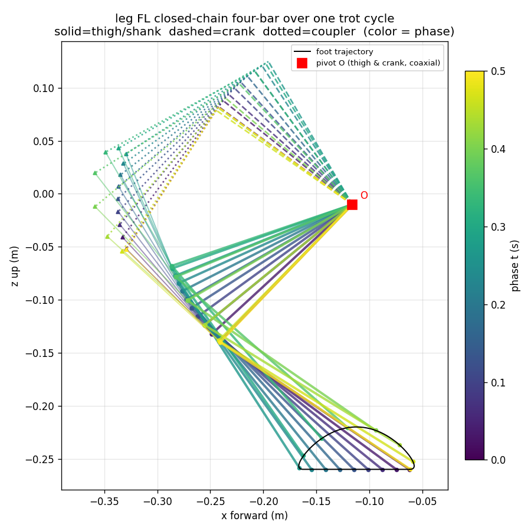

# 🦿 Mos-One 闭链运动学与 MuJoCo 无 RL 行走（底层实现详解）

> 本文把 mos2026_2 从**一个 USD 资产**变成**在 MuJoCo 里 trot 走起来**的每一步都写清楚：
> 长度常量从哪来、怎么提取、公式怎么推、控制环怎么跑、每个问题怎么测出来又怎么修的。
> 对标 `tools/learn/go2_walk.py`（Go2 的纯运动学行走），但 Mos-One 的腿是**闭链**、
> 执行器是 **position**，几乎每一层都要重做。
>
> 建成 2026-07-21，全部自测通过。相关：
> [控制栈总览](./control_stack.md) ｜ [动力学+减速比](./dynamics_gear_ratio_analysis.md) ｜
> [站立平衡控制器](./站立平衡控制器.md)

---

## 目录

- **A. 资产链路**：USD → MJCF → 长度常量（§1–§4）
- **B. 运动学原理**：闭链 FK / IK / Jacobian 逐步推导（§5–§8）
- **C. 步态原理**：足端轨迹怎么画（§9–§11）
- **D. 行走主循环**：控制环逐步拆解（§12–§13）
- **E. 调参实录**：每个问题怎么测出来、怎么修的（§14）
- **F. 测试怎么跑**：一步步验收（§15）
- **G. 影响与短板**（§16–§17）

代码总览：

| 文件 | 作用 | 验证入口 |
|---|---|---|
| `传统步态/代码/closed_chain_kin.py` | 闭链腿解析 FK + 数值 IK + Jacobian | `--selftest` |
| `传统步态/代码/gait.py` | trot 足端轨迹 + 全向指令 | `--selftest` / `--demo` |
| `传统步态/代码/walk_gait.py` | MuJoCo 行走主循环 + 六工况验收 | `--sweep` |

达成率基准：同口径下 `go2_walk.py` 在 Go2 上实测 **82%**，本实现默认工况 **88%**。

---

# A. 资产链路：从 USD 到长度常量

运动学公式里所有的「杆长」「偏置」都是具体数字。这些数字**不是量出来的、也不是拍脑袋
的**，而是从模型资产里一层层提取的。这一部分讲清楚它们从哪来。

## §1. 源头：USD 资产里有什么

原始资产是 Isaac Lab 用的 USD：`source/mos_one/mos_one/assets/robots/mos2026_2_closed_usd/usd/mos2026_2.usd`。
它描述的是一棵刚体树：

- **29 个刚体**（base + 每条腿 7 个：腿根、大腿、小腿、曲柄、连杆、两个电机齿轮）；
- **28 个关节**构成生成树（spanning tree），外加 **4 个闭合关节**（每条腿 1 个）；
- 关节根是 `/mos2026_2/base`。

USD 里每个刚体存的是**世界变换**（world transform），关节存的是轴向和局部锚点。
运动学要用的是**父子相对位置**，所以需要转换。

## §2. 转换：USD → MJCF（`tools/asset/usd_to_mjcf.py`）

这个脚本把 USD 转成 MuJoCo 能读的 MJCF（`deploy/mujoco/assets/mos2026_2.xml`）。
关键的几步（决定了后面常量长什么样）：

1. **每个刚体的局部位姿** `pos/quat` = `inverse(parent_world) · child_world`——
   把 USD 的世界变换换算成 MJCF 需要的「相对父体」变换。**这一步之后，MJCF 里
   `body.pos` 就直接是父子间的平移向量**，也就是我们要的杆长向量。
2. **关节轴** = `localRot1 · unit_axis_USD`（USD 已把 localPos1 都写成 0，所以关节
   位置就是 0）。
3. **4 个闭合关节 → `<equality><connect>` 约束**，锚点写在 body0 的坐标系里
   （USD 的 body0 == MJCF connect 的 body1）。这是后面 `R_B`/`R_S` 的来源。
4. **12 个 `<position>` 执行器**，kp=25、kv=0.5、forcerange ±16，对齐 Isaac Lab 的
   `ImplicitActuatorCfg`。

> 换句话说：USD 存世界坐标 → 转成 MJCF 的父子相对坐标 → 我们要的杆长就是 MJCF 里
> 的 `body.pos`。不需要重新量任何东西，读 XML 就够。

## §3. 提取：每个常量 = MJCF 里的哪个量（可复现）

`closed_chain_kin.py` 里的每个几何常量都能精确溯源到 MJCF 的一行。用
`FL` 腿为例（跑 `python` 读 model 即可复现，见文末命令）：

| 常量 | 含义 | 来源（MJCF） | 值 (x, z) / m |
|---|---|---|---|
| `pivot O` | 两受驱关节公共枢轴 | `body fl_thigh.pos[x,z]` | (−0.116, −0.0101) |
| `R_T` | 大腿（O→膝 K） | `body fl_shank.pos[x,z]` | (−0.144992, −0.106664) |
| `R_A` | 曲柄（O→连杆原点 P1） | `body fl_shank_link_b.pos[x,z]` | (−0.104652, 0.116201) |
| `R_B` | 连杆（P1→锚点 A，被动） | `eq fl_close_loop.data[0:3]` | (−0.10764, −0.11851) |
| `R_S` | 小腿支耳（膝 K→锚点 A） | `eq fl_close_loop.data[3:6]` | (−0.0673, 0.104355) |
| `R_TOE_XZ` | 膝→足端 | 小腿碰撞网格零位最低顶点 | (0.14896, −0.156158) |

杆长即这些向量的模：`|R_A|=0.15638`，`|R_B|=0.16010`，`|R_T|=0.18000`，`|R_S|=0.12417`。

`y_foot`（外摆解算要用的侧偏）= 三段常量 y 偏移之和：大腿挂载 y + 小腿挂载 y + 足端
顶点 y。四条腿这三段各不同，逐腿在 `LEGS` 表里写死。

## §4. 提取后必须做两个验证（否则后面全错）

**验证 1——共轴**（这是「四杆退化」的根据）：
`fl_thigh.pos − fl_shank_link_a.pos = (0, −0.019, 0)`。x/z 都是 0，只有 y 差
0.019 m（装配间隙）。**两个受驱关节的枢轴在矢状面里完全重合**，所以机架杆长为 0，
五杆退化成从同一点 O 引出的两条二连杆链。这是全部推导的地基。

**验证 2——平面性**（这是「能降到 2D」的根据）：
让闭链约束的两条链各自算出锚点 A 的 y 坐标，两者之差 = **1.4e-17 m**（浮点零）。
约束严格落在矢状面内，所以整个 IK/FK 可以在 2D 里做，不损失精度。

> 这两个验证不是形式主义：如果哪天换了带机架偏移或非平面的腿，共轴/平面性不成立，
> 本模块的闭式解就失效，必须回退到数值闭链求解（`stand_balance.py` 里的
> `ClosedChainKin` 就是那种通用但慢的做法）。

---

# B. 运动学原理

坐标约定：**腿系**（leg frame）原点在腿根 body（髋轴）上，x 前、y 左、z 上。矢状面 =
x-z 平面。绕 +y 轴转角 q 等于平面内转 −q（`sgn = −axis_y` 折进常量）。

一个 trot 周期内 FL 腿的四杆姿态（实线=大腿/小腿，虚线=曲柄，点线=连杆，颜色随相位），
叠加足端 D 形轨迹（`gait.py --demo` 生成）：



## §5. 正运动学 FK：给定受驱角 → 足端位置（闭式）

输入两个受驱角 (θ_t 大腿, θ_c 曲柄)，求足端。**5 步**：

1. **膝点** `K = O + R(θ_t)·R_T`（R 是矢状面 2×2 旋转阵）。
2. **曲柄末端** `P1 = O + R(θ_c)·R_A`。
3. **锚点 A = 两圆交点**：A 距 P1 为 `|R_B|`、距 K 为 `|R_S|`。沿 P1→K 方向走距离 `a`，
   再沿法向偏 `±h`：
   ```
   D = K − P1,  d = |D|,  û = D/d,  û⊥ = (−û_z, û_x)
   a = (d² + |R_B|² − |R_S|²) / 2d       # 余弦定理
   h = sqrt(|R_B|² − a²)                  # 半弦长
   A = P1 + a·û + branch·h·û⊥             # branch = −1（见 §8）
   ```
4. **小腿绝对转角** `a_s`：把 `R_S` 转到 `(A − K)` 上，`a_s = atan2(A−K) − atan2(R_S)`。
   被动关节角 `θ_s = (a_s − θ_t·sgn) / sgn`（可直接与 MuJoCo qpos 比对）。
5. **足端** `toe = K + R(a_s)·R_TOE_XZ`。再叠加外摆（绕 x 轴转 hip_ax·θ_hip）和腿根
   挂载点，得到 base 系足端。

外摆是纯几何：矢状链算出 (x, z_sag)，再绕 x 轴把 (y_foot, z_sag) 旋转 hip 角。

## §6. 逆运动学 IK：给定足端 → 受驱角（解析髋 + 数值矢状）

输入足端 (px, py, pz)，求 (θ_hip, θ_t, θ_c)。**分两段**：

**第一段——髋角，解析。** 矢状链不改变腿系 y（恒为 `y_foot`），所以绕 x 轴的旋转由
足端的 (y, z) 唯一确定：
```
z_sag = −sqrt(py² + pz² − y_foot²)          # 矢状面内的 z（足端在下方）
φ = atan2(pz, py) − atan2(z_sag, y_foot)
θ_hip = φ / hip_ax
```
这一段是闭式的、精确的。

**第二段——(θ_t, θ_c)，数值。** 目标：让 FK 的足端命中矢状面点 (px, z_sag)。这是
2 元 2 式，用 **Levenberg 阻尼牛顿**迭代（**每步 4 小步**）：

1. 算当前 FK 足端与目标的残差 `err = target − FK(q)`；残差 < tol 则收敛退出；
2. 用解析 FK 的**中心差分**拼出 2×2 Jacobian（FK 很便宜，差分够准又不易写错）；
3. 阻尼牛顿步 `Δq = (JᵀJ + λI)⁻¹ Jᵀ err`，`λ = 1e-9 + 1e-3·|err|`（奇异位形附近
   J 病态，阻尼防止步长炸掉）；
4. `q ← clip(q + Δq, ±1.57)`。

**多起点兜底**：靠近奇异位形时单起点会卡在 `h=0` 边界（该方向梯度为 0），所以准备一组
初值（第一个用调用方给的延拓 seed，其余是固定散点），谁先收敛用谁。

## §7. Jacobian：足端速度 ↔ 关节角速度

`J = ∂foot/∂(hip, thigh, crank)`，3×3，取解析 FK 的中心差分。满足
`foot_dot = J·q_dot`，反过来 `q_dot = J⁻¹·foot_dot`（速度映射，speed_map 用）；
`τ = Jᵀ·F`（力雅可比，做重力前馈用）。

## §8. 装配分支与奇异位形——`margin`

§5 第 3 步的两圆交点**有两个**（`branch=±1`），对应机构的两个**装配分支**。取
`branch=−1`——它是 qpos=0 处与 MJCF 装配一致的那支（自测里验过 qpos=0 时约束残差为 0，
且 branch=−1 复现了 MJCF 锚点）。

`h`（半弦长）就是**离奇异位形的余量**，记作 `margin`：
- `h → 0` 时两圆相切，两个分支在此汇合，FK 有 sqrt 型分支点、导数发散；
- 这正是历史文档「**MuJoCo 闭链翻分支**」的精确刻画——低增益下机身下沉，被动角穿过
  `h=0` 滑进折叠分支，机身塌到 ~0.17 m。

本模块解析式固定取 `branch=−1`，**永不翻**，所以它同时是「判断仿真有没有翻分支的
裁判」：把 MuJoCo 的实际关节角喂进 `solve_linkage`，`margin` < 5 mm 就危险。零位站姿
`margin ≈ 85 mm`，余量很宽裕。

## §8b. 足端点是唯一的估计量（软肋）

MJCF 没有 foot site。取小腿碰撞网格**零位（小腿竖直）时的最低顶点**
`(0.14896, ·, −0.156158)` 作触地点。⚠️ 足底是**圆弧面不是尖点**：最低点 2 mm 内有
**173 个顶点**、x 向跨度 19 mm。小腿转动时触地点沿弧面迁移，定点近似在 ±0.3 rad 内
误差约 ±2 mm。第一版误取「离膝最远顶点」，落地测试暴露偏高 9 mm，已改（见 §14.1）。

---

# C. 步态原理

## §9. trot 相位调度

对角小跑：FL+RR 同相，FR+RL 差半个周期。相位
`p = (t/period + phase_offset[leg]) mod 1`，`p < duty` 为支撑相。`duty=0.5`（trot）。

## §10. 足端轨迹——支撑相 + 摆动相

足端在**腿系**给出，随相位走一条 D 形轨迹（**支撑贴地、摆动抬腿前送**）：

- **支撑相**（`p < β`，`s = p/β`）：足端贴地，水平从 +L/2 扫到 −L/2（`f = 0.5 − s`），
  z 不变。足端不动、机身前进。
- **摆动相**（`s = (p−β)/(1−β)`）：水平前送（型线见 §11），竖直用
  `z = z0 + h·(1−cos(2πs))/2`（两端速度为 0，落地/离地不冲击）。

水平位移 = `x0 + Lx·f(s)`，`x0` 是名义站姿 x（由零位 FK 的 `NOMINAL_X` 给），`Lx` 是
步向量（§11.2）。x 与 y 共用同一个归一化型线 `f`，所以转向/侧移不会与前进相位错开。

> 接口注记：`foot_target` 返回**腿系**坐标（不是 go2_walk 折入挂载偏移的髋系）。零位
> 站姿在腿系里不在原点正下方（四杆前后镜像：前腿 x≈−0.112，后腿 x≈+0.131），所以
> `x_offset` 是**相对名义站姿**的增量。输出的三元组是 (θ_hip, θ_thigh, θ_crank)，
> **就是 MJCF/电机关节角**，无中间映射。

## §11. 两个关键设计

### §11.1 摆动型线要匹配落地速度（`swing_profile`）

**这是速度损失的第一个来源。** 原摆线（cycloid）落地瞬间足端相对机身水平速度为 0，
即相对**地面**以 +v 前移，一触地被摩擦刹住，每步损失一截。

改用**三次多项式**（`swing_profile="matched"`，默认），让摆动相端点速度 = 支撑相速度
`−L·r`（`r=(1−β)/β`）：
```
f(s) = −1/2 − r·s + 3(1+r)·s² − 2(1+r)·s³
β=0.5(r=1) ⇒ f(s) = −1/2 − s + 6s² − 4s³
```
边界条件：`f(0)=−1/2, f(1)=+1/2, f'(0)=f'(1)=−r`。C1 连续（`--selftest` 验过摆动相
端点速度 −0.3998 vs 支撑相 −0.4000）。

### §11.2 全向指令——v + ω×r

前进量由 `step_length` 给（兼容既有调用方），侧移 `vy`/转向 `wz` 按速度给，换算成
**各腿自己的**支撑相扫掠量。刚体上一点速度 `v_i = v + ω × r_i`：
```
step_x = step_length − wz·r_y·t_stance     # (ω×r)_x = −wz·r_y
step_y = (vy + wz·r_x)·t_stance            # (ω×r)_y = +wz·r_x
```
`r` 是该足端相对机身中心的名义位置。转向时左右腿步长不同——这正是四足能原地转的
原因。`--selftest §5b` 验证左右扫掠反号、前后腿侧向反号（能形成绕 z 的旋转）。

工作域保护：`joint_targets` 里 IK 不收敛会**抛错**（报残差与 margin），不会悄悄给
错解。`--selftest §6` 验证 `body_height=0.42`（超臂展）被拒。

---

# D. 行走主循环

## §12. 控制环逐步（`walk_gait.py`）

1. **建模型**：读 scene.xml，`timestep=1ms`（SIM_HZ=1000）。
2. **改增益**：把 12 个 `<position>` 的 kp 从 25 改成 **320**、kv 改成 3.2（见 §13①）。
3. **站起来**：`qpos[2]=spawn_height`，先 `mj_forward` 算一次 xmat（否则姿态阵全 0），
   下发零时刻站姿目标，空转 `settle`（默认 1 s）稳住。
4. **主循环**（每 1 ms 一步，每 5 ms 更新一次指令，CONTROL_HZ=200）：
   - 相位推进 → `gait.foot_target` 各腿足端 → `leg_ik`（用上一解 seed 延拓）→ 12 目标角；
   - `data.ctrl = 目标角`，`mj_step`；
   - 逐步积分机体系速度（转向后世界系净位移不代表前进量）、累计 yaw、记录站高；
   - 摔倒判据用**姿态**（`upright < 0.5`）而非绝对高度（爬坡时高度本就会变）。
5. **收尾统计**：机体系平均 vx/vy、wz、站高均值±std、最小奇异余量；再用**实际**关节角
   复算 margin，< 5 mm 判为翻分支（退出码 4）。

## §13. 与 Go2 的三处硬差异

**① position 执行器**：`data.ctrl` 是目标角不是力矩，所以没有 go2_walk 的 PD + τ=JᵀF
重力前馈。重力静差靠提高 kp 解决。

**② 要用足够硬的位置增益（默认 kp=500）**：XML 的 kp=25 是软伺服，静差
≈τ_g/kp≈0.3 rad，机身下沉、穿过奇异位形翻分支，站高只剩 ~0.17 m。增益还直接决定
**机身竖直起伏**：trot 每半周期对角腿交替颠一下（2×步频的「双支撑颠簸」），kp=320
时峰峰 ~20 mm，**kp=500 降到 ~14 mm、std 减半，且不损速度（反而因跟踪更好、打滑更少，
达成率 88%→91%）**，故默认 kp=500、kv=5.0。做 sim2real 保真（对齐真机关节侧增益
~320）时用 `--kp 320 --kv 3.2`，会颠得更明显。想更平：`--bob-comp 0.002` 加一个
锁定 2×步频的竖直前馈，默认工况可再压到 ~10 mm（见 §14.6）。

**③ IK 用延拓（seed）**：每周期用上一解做初值，既快又保证解连续、不在两个装配分支
之间跳。

---

# E. 调参实录：每个问题是怎么测出来、怎么修的

这一节是「如何一步步测试并定位问题」的实录。速度达成率从最初的 50% 提到 88%，靠的是
**每一步都用仿真里的量化测量定位真凶**，而不是猜。

## §14.1 足端点偏高 9 mm——落地静置测出来

**测法**：让机器人在 MuJoCo 里以零位姿站稳（部署增益），用**稳态实际关节角**做 FK，
算足端预测的世界 z，理想应≈0（刚好触地）。第一版偏高 9 mm。
**根因**：足端点取了「离膝最远顶点」，但真实触地是最低顶点（足底圆弧面）。
**修**：改取零位最低顶点，落地偏差降到 1.2 mm（`--selftest §3b` 常驻此检查）。

## §14.2 速度只有 50%——摆动落地打滑

**测法**：`mj_objectVelocity` 测支撑期足端水平速度，非零即打滑。
**根因**：摆线落地速度不匹配（§11.1）。**修**：换 matched 型线。→ 提到 58%。

## §14.3 还是只有 58%——后腿拖地（真凶）

**测法**（三个诊断脚本联合）：
1. 逐腿测**实际占空比**（接触时间占比）：前腿 0.53、**后腿 0.75**（规划都是 0.50）；
2. 按相位分箱测**离地峰值**：前腿 44 mm、**后腿只有 7 mm**；
3. 腿系 vs 世界系足端 z 对照：腿系里四腿都正常跟踪（后腿也到 40 mm），**世界系里
   后腿却上不去**——差异来自机身姿态；
4. 测机身 pitch/roll：**pitch 在 0.4°~2.4° 之间摆、roll ±2.6°**，与步态同频。

**根因**：算 CoM 相对支撑中心的位置——**CoM 在支撑中心后方 23.6 mm**。trot 任一时刻
只有对角两腿支撑，重心偏后使机身持续点头，把后腿的离地量吃掉。

**修**：`x_offset` 把足端整体后移做配平。扫描 0 → −90 mm，最优 **−55~−60 mm**
（比静态配平量 23.6 mm 大，多出来的在压**动态**点头）：

| 指标 | 配平前 | 配平后(−55mm) |
|---|---|---|
| pitch | ±0.80° | ±0.55° |
| roll | ±2.57° | ±1.13° |
| 四腿占空比 | 0.53/0.75 | 对称 0.59 |
| 达成率 | 58% | **88%** |

## §14.4 一条没走通的路（保留为反例）

试过把摆动腿足端目标转到**重力对齐水平系**（`p_body = R_bodyᵀ·R_yaw·p_level`，
`--level-feet`），想让机身怎么歪、摆动腿离地高度都不变。**实测反而更差**
（vx 0.233 → −0.013）：支撑/摆动切换瞬间目标阶跃 ~11 mm，对 kp=320 硬伺服等于每步
敲两下。且**绝不能**用在支撑腿上——脚踩地时对它下发「保持世界高度」会让机身去适应
脚，前倾时反而收短前腿、压低机身，正反馈 0.4 s 内发散到 IK 无解。开关保留（默认关），
留待后续接姿态 PD 时平滑混合。**支撑腿的姿态修正是反号的**（低的那侧要伸长），那是
姿态 PD 的活，见 `stand_balance.py`。

## §14.5 校准锚点：用 go2_walk 当基准

怎么知道 88% 算好？跑参照实现 `go2_walk.py` 本身——**Go2 在同口径下只有 82%**。
开环步态的足端打滑是固有的，本实现已超过参照，不是缺陷。验收门槛因此定在 70%。

## §14.6 机身竖直起伏（"颠"）——先测频率再对症

**现象**：机身上下颠。**测法**：记录 base 高度 z(t)，看峰峰值与 FFT 主频，再按步态
相位分箱看波形。结果：峰峰 **20 mm，主频 4 Hz = 2×步频**，波形在每次对角腿交替
（双支撑）后升、支撑中期降——典型的 trot「双支撑颠簸」，不是漂移也不是失稳。

**对症下药**（扫了 step_height / period / body_height，基本没用；有用的两个）：

1. **增益 kp**：颠簸本质是位置伺服对「支撑相恒高足端指令」的跟踪误差。kp 越硬跟得越紧。
   实测 kp 320→500 峰峰 **20→14 mm、std 减半**，且因跟踪更好、打滑更少，**速度还升了**
   （88%→91%）。纯赚，已设为默认。再往上（700+）边际很小。
2. **竖直前馈 `--bob-comp`**：颠簸是**确定性**的（锁定 2×步频），可直接前馈抵消——给
   全部足端一个按全局相位 `sin(2·2π·φ + BOB_PHASE)` 的 z 补偿。默认工况网格搜索得
   幅值 0.002 m、相位 3.25 rad，峰峰再压到 **~10 mm**。但它锁定在特定周期/步幅，换速度
   要重调，故默认关、作专家旋钮。

| 配置 | 峰峰 | std | 达成率 |
|---|---|---|---|
| kp 320（部署保真） | 20 mm | 6.9 mm | 88% |
| **kp 500（默认）** | **14 mm** | **3.1 mm** | 91% |
| kp 500 + bob-comp 0.002 | 10 mm | 3.0 mm | 88% |

---

# F. 测试怎么跑

## §15. 一步步验收

环境：训练/MuJoCo 用 `/home/maybe/code/rl/env_isaaclab/bin/python`（torch+mujoco）。

**第 1 步——运动学自洽 + 与 MuJoCo 交叉验证**
```bash
$PY 传统步态/代码/closed_chain_kin.py --selftest
```
看这几行（数量级对上即可）：被动角 9.7e-08 rad、膝点 1.2e-16 m、小腿姿态 9.6e-08、
FK→IK→FK 往返足端 1.0e-10 m 未收敛 0/2000、落地静置足端点偏差 1.2 mm。

**第 2 步——步态自洽**
```bash
$PY 传统步态/代码/gait.py --selftest
```
覆盖：IK 往返、关节限位、奇异余量>10mm、轨迹连续、对角相位、转向/侧移 v+ω×r 符号、
超工作域报错。

**第 3 步——速度映射自洽**
```bash
$PY 传统步态/代码/speed_map.py --selftest
```
解析足端速度 vs 数值微分 2e-6、Jacobian 往返、关节角速度量级核对。

**第 4 步——单次行走**
```bash
$PY 传统步态/代码/walk_gait.py --headless -T 10
```
期望：站住、upright≈1.0、vx≈0.35（达成率 88%）、站高 std<10mm、余量>80mm。
退出码：0=成功，3=摔倒，4=翻分支。

**第 5 步——六工况验收（总闸）**
```bash
$PY 传统步态/代码/walk_gait.py --sweep -T 10
```
慢走/默认/中速/快走/走+左转/走+右转，门槛：不摔、达成率>70%、站高 std<20mm、
转向误差<0.15 rad/s。全过打印 `✅ 全部工况通过`。

**第 6 步——可视化 & 出图（可选）**
```bash
MUJOCO_GL=glx $PY 传统步态/代码/walk_gait.py --viewer          # 开窗看
$PY 传统步态/代码/gait.py --demo                               # 关节曲线/足端轨迹/四杆图
$PY 传统步态/代码/walk_gait.py --headless --step-length 0 --wz 0.5   # 原地转
```

**复现 §3 的常量溯源**（想自己核对长度从哪来）：
```bash
$PY -c "import mujoco; m=mujoco.MjModel.from_xml_path('deploy/mujoco/assets/mos2026_2.xml'); \
import numpy as np; b=lambda n: m.body_pos[mujoco.mj_name2id(m,mujoco.mjtObj.mjOBJ_BODY,n)]; \
print('O =',b('fl_thigh')[[0,2]]); print('R_T=',b('fl_shank')[[0,2]]); print('R_A=',b('fl_shank_link_b')[[0,2]])"
```

---

# G. 影响与短板

## §16. 对既有代码的影响

**退役**：`传统步态/代码/kinematics.py` 的 3-DOF 串联近似。它的 L2=0.16 是「XML 无
foot site 按站立几何估计」的猜测值，且「shank 电机轴↔等效膝角」的闭链传动比从未标定，
输出的「约定角」需要一层**不存在的**仿射映射才能下发——即实际无法部署。

**已切到 closed_chain_kin**：
- `gait.py`：IK 后端整体替换，接口从「约定角/髋系」变为「电机角/腿系」；
- `speed_map.py`：Jacobian 建在真实四杆上，输出第三列就是 shank_link 曲柄电机自己的
  角速度（不再是「等效膝角 × 未标定传动比」）；解析足端速度随新摆动型线重推。

**仍用串联近似**：`dynamics.py` 的矢状面静力递推（自洽，用于减速比选型，够用）。其
`joint_targets` 取到的现在是真实电机角，可直接对 T-N 曲线读。

## §17. 已知短板与后续

1. **纯侧移弱**：`vy=0.15` 只走出 0.077 m/s，且寄生偏航 −0.18 rad/s（前进/转向正常）。
   受限于髋外摆权限，需专门处理。
2. **足端点是定点近似**（§8b），圆弧足底 ±2 mm。要更准需拟合足底圆弧半径。
3. **开环无反馈**：站高长时行走会缓慢漂移（15 s 末值 0.257 vs 均值 0.248）。接姿态 PD
   / 站高积分可收住，也是通往 §14.4「摆动腿水平系平滑混合」的前置。
4. **sim2real 增益**：默认 kp=500 是为了压机身起伏（§14.6）；真机部署增益是关节侧
   ~320，用 `--kp 320 --kv 3.2` 复现那个更颠的行为。真机的
   闭链物理限位、足底材料摩擦与本仿真有差，落地打滑率会变。
